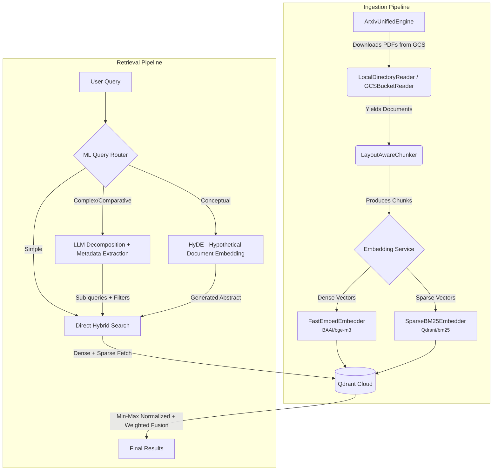

# ArXiv Scholar

**A high-performance Retrieval-Augmented Generation (RAG) system for AI Engineering research.**

ArXiv Scholar is an end-to-end pipeline that ingests, parses, chunks, and embeds academic papers from [arXiv](https://arxiv.org) into a hybrid vector database — enabling fast semantic search over scientific documents. Built from scratch without high-level abstraction frameworks (no LangChain) for full architectural control and transparent failure modes.

> **Status:** ~5,600 AI Engineering papers indexed on Qdrant Cloud. Streaming API live. Scaling via agent-driven ingestion planned.

---

## Table of Contents

- [Architecture](#architecture)
- [Key Features](#key-features)
- [Project Structure](#project-structure)
- [Tech Stack](#tech-stack)
- [Getting Started](#getting-started)
- [Usage](#usage)
- [Evaluation](#evaluation)
- [Contributing](#contributing)
- [License](#license)

---

## Architecture



> **Note on reranking:** A cross-encoder reranker (`jina-reranker-v1-tiny-en`) is implemented in the codebase but is **disabled by default** (`USE_RERANKER=False`). During benchmarking, the reranker caused performance degradation on the current corpus size and was turned off. The code is retained for future evaluation at larger scale.

### Pipeline Stages

| Stage | Component | Description |
|:------|:----------|:------------|
| **Download** | `ArxivUnifiedEngine` | Streams PDFs from the public `arxiv-dataset` GCS bucket in configurable batches. Maintains a JSON cursor (`current_month`, `last_file`) for resumable, crash-safe ingestion across YYMM folders. |
| **Parsing** | `LocalDirectoryReader` / `GCSBucketReader` | Extracts raw text from PDFs via PyMuPDF. Computes SHA-256 hashes for deduplication and extracts arXiv IDs from filenames using regex. GCS reader operates fully in-memory for serverless deployments. |
| **Chunking** | `LayoutAwareChunker` | Uses [Docling](https://github.com/DS4SD/docling) to visually parse PDF layouts (headers, paragraphs, tables) and produce semantically grouped chunks. Falls back to `SlidingWindowChunker` for oversized blocks or when Docling is unavailable. |
| **Embedding** | `SentenceTransformerEmbedder` + `SparseBM25Embedder` | Generates dense vectors (BAAI/bge-m3) via SentenceTransformers (PyTorch) and sparse BM25 vectors via FastEmbed (ONNX) concurrently. |
| **Storage** | `QdrantVectorStore` | Upserts chunks with deterministic UUID-v5 point IDs to Qdrant Cloud. Supports both cloud mode (URL + API key) and in-memory mode for testing. |
| **Retrieval** | `HybridRetriever` | Fetches dense and sparse results independently, applies min-max normalization, and fuses scores with configurable weights (default: dense=1.0, sparse=0.3). |

---

## Key Features

- **Hybrid Search** — Combines dense semantic embeddings with sparse BM25 keyword matching, fused via weighted min-max normalization for superior recall over either method alone.
- **Intelligent Query Routing** — A hybrid ML + heuristic router (<1ms) classifies incoming queries into Direct, Decompose, or HyDE paths. Includes regex-based **Hard Overrides** for guaranteed metadata routing (e.g., year filtering) without ML hallucinations, plus short-query detection that auto-routes to HyDE.
- **LLM-Powered Query Decomposition** — Complex queries are split into atomic sub-queries with strict metadata filters (e.g., publication year) extracted via JSON from an LLM. Filters are applied natively at the Qdrant Prefetch level.
- **Dynamic Compute Budgeting** — Sub-queries from decomposition are fetched concurrently and pooled before global deduplication and scoring. The fetch budget is dynamically allocated across sub-queries.
- **Layout-Aware PDF Parsing** — Docling-based visual document understanding preserves the semantic structure of academic papers (sections, tables, equations) instead of naive text splitting.
- **Crash-Safe Batch Ingestion** — Cursor-based state management allows the pipeline to resume from the exact point of failure across large ingestion runs.
- **Streaming API** — FastAPI endpoint with Server-Sent Events (SSE) streams retrieved sources and LLM-synthesized answers token-by-token.

---

## Project Structure

```
arxiv-scholar/
├── main.py                          # Full ingestion pipeline orchestrator
├── app.py                           # Streamlit chat UI
├── configs/
│   └── config.py                    # Centralized env-var-backed configuration
├── src/arxiv_scholar/
│   ├── schema.py                    # Core data models (Document, Chunk)
│   ├── api/
│   │   ├── schema.py                # REST API request/response models (SSE events)
│   │   └── server.py                # FastAPI streaming endpoint (POST /api/v1/query)
│   ├── chunking/
│   │   ├── base.py                  # Abstract BaseChunker interface
│   │   ├── layout.py                # Docling-based layout-aware chunker
│   │   └── sliding_window.py        # Fixed-size sliding window fallback chunker
│   ├── download/
│   │   └── arxiv_ingestion.py       # GCS-backed PDF downloader with cursor state
│   ├── embedding/
│   │   ├── base.py                  # Abstract BaseEmbedder interface
│   │   ├── fastembed_embedder.py    # ONNX CPU embedder (dense + sparse BM25)
│   │   └── st_embedder.py           # SentenceTransformer embedder (GPU)
│   ├── ingestion/
│   │   ├── base.py                  # Abstract DocumentReader interface
│   │   ├── local.py                 # Local filesystem PDF reader (PyMuPDF)
│   │   └── gcs.py                   # In-memory GCS bucket reader (serverless)
│   ├── llm/
│   │   └── service.py               # LLM client (decomposition, HyDE, synthesis)
│   ├── retrieval/
│   │   ├── retrieval.py             # Hybrid retriever with weighted fusion
│   │   ├── orchestrator.py          # Query orchestrator (routes → retrieves → fuses)
│   │   └── router.py                # ML + heuristic query router
│   └── storage/
│       ├── base.py                  # Abstract BaseVectorStore interface
│       └── qdrant_store.py          # Qdrant client (upsert, search, hybrid search)
├── scripts/
│   ├── generate_arxiv_manifest.py   # Paper selection criteria & manifest generator
│   ├── download_qdrant.sh           # Qdrant binary installer
│   ├── generate_eval_dataset.py     # Evaluation dataset generator
│   ├── run_benchmarks.py            # Retrieval benchmark runner
│   └── ...                          # Various ingestion and import utilities
├── colab/
│   ├── batch_gcs_to_drive.py        # Colab script: batch download from GCS
│   └── generate_embedded_dataset.py # Colab script: embed and push to Qdrant Cloud
├── notebooks/                       # Jupyter notebooks for development & testing
├── tests/                           # Unit and integration tests
├── docs/                            # GitHub Pages website
├── Dockerfile                       # Production container (HF Spaces / Cloud Run)
├── docker-compose.yml               # Local Qdrant service definition
└── pyproject.toml                   # Project metadata and dependencies
```

---

## Tech Stack

| Layer | Technology | Purpose |
|:------|:-----------|:--------|
| **Dense Embedding** | `BAAI/bge-m3` via FastEmbed (ONNX) | Semantic vectors, CPU-optimized |
| **Sparse Embedding** | `Qdrant/bm25` via FastEmbed | BM25 term-frequency vectors for keyword matching |
| **Vector Database** | Qdrant Cloud | Hybrid storage with server-side query batching |
| **PDF Parsing** | PyMuPDF + Docling | Text extraction and layout-aware chunking |
| **API** | FastAPI + Uvicorn | Streaming SSE endpoint |
| **LLM** | Configurable (OpenAI-compatible API) | Query decomposition, HyDE generation, answer synthesis |
| **Query Router** | scikit-learn + regex heuristics | Sub-millisecond query classification |
| **Orchestration** | Pure Python (no LangChain) | Full architectural control |

---

## Getting Started

### Prerequisites

- Python ≥ 3.10
- [uv](https://docs.astral.sh/uv/) (recommended) or pip

### Installation

```bash
# Clone the repository
git clone https://github.com/dubeyaayush07/arxiv-scholar.git
cd arxiv-scholar

# Create a virtual environment and install dependencies
uv venv && source .venv/bin/activate
uv pip install -e .
```

### Environment Variables

Create a `.env` file or export the following:

```bash
# Required — Qdrant Cloud connection
export QDRANT_URL="your_qdrant_cloud_url"
export QDRANT_API_KEY="your_qdrant_api_key"
export QDRANT_COLLECTION="Arxiv-Scholar"

# Required for LLM features (decomposition, HyDE, answer synthesis)
export LLM_API_KEY="your_key_here"
export LLM_BASE_URL="https://generativelanguage.googleapis.com/v1beta/openai/"  # or any OpenAI-compatible endpoint
export LLM_MODEL="claude-haiku-4-5"

# Optional overrides (defaults shown)
export EMBEDDING_BACKEND="fastembed"            # or "sentence-transformers"
export EMBEDDING_MODEL="BAAI/bge-m3"
export SPARSE_EMBEDDING_MODEL="Qdrant/bm25"
export USE_RERANKER="False"                     # Disabled — causes performance degradation
export DENSE_WEIGHT="1.0"
export SPARSE_WEIGHT="0.3"

# For local Qdrant (alternative to cloud)
export QDRANT_HOST="localhost"
export QDRANT_PORT="6333"
```

---

## Usage

### Ingestion Pipeline

The full ingestion pipeline is implemented in [`main.py`](main.py). It downloads PDFs from the arXiv GCS bucket, parses them with Docling, chunks them, generates dual embeddings, and upserts to Qdrant.

```bash
# Trial run (downloads 2 PDFs, processes in-memory Qdrant)
python main.py --trial

# Production run (continuous batch ingestion)
python main.py
```

> **How we actually ingested data:** Due to local compute constraints, the initial ~5,600 paper corpus was ingested via Google Colab. The [`colab/batch_gcs_to_drive.py`](colab/batch_gcs_to_drive.py) script batches PDFs from GCS, and [`colab/generate_embedded_dataset.py`](colab/generate_embedded_dataset.py) generates embeddings and pushes them to Qdrant Cloud. See [`scripts/generate_arxiv_manifest.py`](scripts/generate_arxiv_manifest.py) for the exact paper selection criteria (keyword groups, domain exclusions, golden terms).

### API Server

The API server is implemented in [`src/arxiv_scholar/api/server.py`](src/arxiv_scholar/api/server.py). It exposes a streaming SSE endpoint that routes queries, retrieves results, and synthesizes answers via LLM.

**Live hosted endpoint** (Hugging Face Spaces):

```bash
curl -N -X POST "https://trinetra-dev-arxiv-scholar.hf.space/api/v1/query" \
  -H "Content-Type: application/json" \
  -d '{
    "query": "What is contrastive learning?",
    "limit": 5,
    "use_reranker": false
  }'
```

**Run locally:**

```bash
# Start the server
uvicorn arxiv_scholar.api.server:app --reload

# Or via Docker
docker build -t arxiv-scholar .
docker run -p 7860:7860 --env-file .env arxiv-scholar
```

```bash
# Query your local instance
curl -N -X POST http://localhost:8000/api/v1/query \
  -H "Content-Type: application/json" \
  -d '{"query": "attention mechanisms in transformers", "limit": 10, "use_reranker": false}'
```

### Running Tests

```bash
pytest tests/ -v
```

---

## Evaluation

The retrieval pipeline is evaluated using programmatic metrics via [`scripts/run_benchmarks.py`](scripts/run_benchmarks.py).

```bash
# Generate evaluation dataset
python scripts/generate_eval_dataset.py

# Run benchmarks
python scripts/run_benchmarks.py
```

---

## Paper Selection Criteria

Papers are curated using a multi-dimensional filtering system defined in [`scripts/generate_arxiv_manifest.py`](scripts/generate_arxiv_manifest.py):

- **Target Categories:** `cs.CL`, `cs.AI`, `cs.IR`, `cs.LG`, `cs.SE`
- **Date Filter:** Papers updated after 2022-01-01
- **Keyword Groups:** RAG & Retrieval, Large Language Models, Agents & Reasoning, Training & Alignment, Safety & Quality, Inference & Systems, AI Developer Tools
- **Inclusion Logic:**
  - **Golden Term Bypass:** Ultra-high-signal terms (vLLM, SWE-bench, FlashAttention, etc.) → auto-include
  - **Regular:** Matches ≥ 3 keyword groups
  - **Rescued:** Matches exactly 2 groups + ≥ 2 AI engineering meta-terms (pipeline, benchmark, framework, etc.)
- **Domain Exclusions:** Medical, physics, quantum, agriculture, autonomous driving, pure math theory, etc.

---

## Contributing

Contributions are welcome. Please open an issue first to discuss proposed changes.

1. Fork the repository.
2. Create a feature branch (`git checkout -b feature/your-feature`).
3. Commit your changes (`git commit -m "feat: add your feature"`).
4. Push to your fork and open a Pull Request.

---

## License

This project is open-source under the [MIT License](LICENSE).
