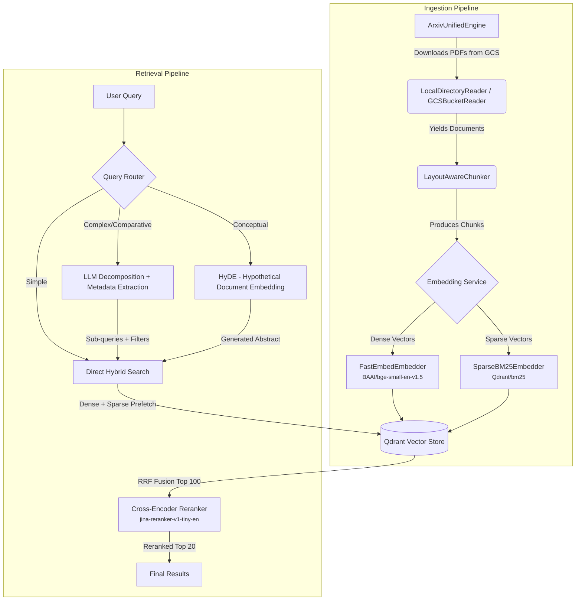

# ArXiv Scholar

**A high-performance Retrieval-Augmented Generation (RAG) system over the arXiv corpus.**

ArXiv Scholar is an end-to-end pipeline that ingests, parses, chunks, and embeds academic papers from [arXiv](https://arxiv.org) into a hybrid vector database — enabling sub-250ms semantic search over millions of scientific documents. Built from scratch without high-level abstraction frameworks (no LangChain) for full architectural control and transparent failure modes.

> **Status:** Core pipeline complete. Large-scale ingestion in progress. Public API coming Q3 2026.

---

## Table of Contents

- [Architecture](#architecture)
- [Key Features](#key-features)
- [Project Structure](#project-structure)
- [Tech Stack](#tech-stack)
- [Getting Started](#getting-started)
- [Usage](#usage)
- [Evaluation](#evaluation)
- [Contributing](#contributing)
- [License](#license)

---

## Architecture



### Pipeline Stages

| Stage | Component | Description |
|:------|:----------|:------------|
| **Download** | `ArxivUnifiedEngine` | Streams PDFs from the public `arxiv-dataset` GCS bucket in configurable batches. Maintains a JSON cursor (`current_month`, `last_file`) for resumable, crash-safe ingestion across YYMM folders. |
| **Parsing** | `LocalDirectoryReader` / `GCSBucketReader` | Extracts raw text from PDFs via PyMuPDF. Computes SHA-256 hashes for deduplication and extracts arXiv IDs from filenames using regex. GCS reader operates fully in-memory for serverless deployments. |
| **Chunking** | `LayoutAwareChunker` | Uses [Docling](https://github.com/DS4SD/docling) to visually parse PDF layouts (headers, paragraphs, tables) and produce semantically grouped chunks. Falls back to `SlidingWindowChunker` for oversized blocks or when Docling is unavailable. |
| **Embedding** | `FastEmbedEmbedder` + `SparseBM25Embedder` | Generates dense vectors (BAAI/bge-small-en-v1.5, 384-dim) and sparse BM25 vectors concurrently using ONNX Runtime. No PyTorch dependency required at inference time. |
| **Storage** | `QdrantVectorStore` | Upserts chunks with deterministic UUID-v5 point IDs. Supports both server mode (Docker) and in-memory mode for testing. |
| **Retrieval** | `HybridRetriever` | Performs server-side Reciprocal Rank Fusion (RRF) across dense and sparse prefetch lanes in Qdrant. Optionally reranks with a cross-encoder. |

---

## Key Features

- **Hybrid Search** — Combines dense semantic embeddings with sparse BM25 keyword matching, fused via Reciprocal Rank Fusion (RRF) for superior recall over either method alone.
- **Intelligent Query Routing** — A fast NLP-based router (<1ms) classifies incoming queries into three execution paths: Direct, Decompose (for comparative/multi-hop queries), or HyDE (for conceptual queries).
- **LLM-Powered Query Decomposition** — Complex queries are split into atomic sub-queries with metadata filters (e.g., publication year) extracted via structured JSON output from an LLM. Filters are applied natively at the Qdrant Prefetch level.
- **Layout-Aware PDF Parsing** — Docling-based visual document understanding preserves the semantic structure of academic papers (sections, tables, equations) instead of naive text splitting.
- **Crash-Safe Batch Ingestion** — Cursor-based state management allows the pipeline to resume from the exact point of failure across millions of documents.
- **Cross-Encoder Reranking** — A lightweight ONNX-optimized Jina reranker performs secondary cross-attention scoring to maximize precision in the final top-20 results.
- **Streaming API** — FastAPI endpoint with Server-Sent Events (SSE) streams retrieved sources and LLM-synthesized answers token-by-token.

---

## Project Structure

```
arxiv-scholar/
├── main.py                          # Pipeline orchestrator (entry point)
├── configs/
│   └── config.py                    # Centralized env-var-backed configuration
├── src/arxiv_scholar/
│   ├── schema.py                    # Core data models (Document, Chunk)
│   ├── api/
│   │   ├── schema.py                # REST API request/response models (SSE events)
│   │   └── server.py                # FastAPI streaming endpoint (POST /api/v1/query)
│   ├── chunking/
│   │   ├── base.py                  # Abstract BaseChunker interface
│   │   ├── layout.py                # Docling-based layout-aware chunker
│   │   └── sliding_window.py        # Fixed-size sliding window fallback chunker
│   ├── download/
│   │   └── arxiv_ingestion.py       # GCS-backed PDF downloader with cursor state
│   ├── embedding/
│   │   ├── base.py                  # Abstract BaseEmbedder interface
│   │   ├── fastembed_embedder.py    # ONNX CPU embedder (dense + sparse BM25)
│   │   └── st_embedder.py           # PyTorch SentenceTransformer embedder (GPU)
│   ├── ingestion/
│   │   ├── base.py                  # Abstract DocumentReader interface
│   │   ├── local.py                 # Local filesystem PDF reader (PyMuPDF)
│   │   └── gcs.py                   # In-memory GCS bucket reader (serverless)
│   ├── retrieval/
│   │   └── retrieval.py             # Hybrid retriever with RRF + cross-encoder reranking
│   └── storage/
│       ├── base.py                  # Abstract BaseVectorStore interface
│       └── qdrant_store.py          # Qdrant client (upsert, search, hybrid search)
├── scripts/
│   ├── download_qdrant.sh           # Qdrant binary installer
│   ├── generate_eval_dataset.py     # Evaluation dataset generator
│   └── run_benchmarks.py            # Retrieval benchmark runner
├── tests/
│   ├── test_embedding.py            # Embedding backend tests
│   ├── test_ingestion.py            # Document ingestion tests
│   ├── test_qdrant.py               # Qdrant connectivity tests
│   └── test_storage.py              # Vector store operation tests
├── docs/                            # GitHub Pages website
├── docker-compose.yml               # Qdrant service definition
└── pyproject.toml                   # Project metadata and dependencies
```

---

## Tech Stack

| Layer | Technology | Purpose |
|:------|:-----------|:--------|
| **Dense Embedding** | `BAAI/bge-small-en-v1.5` via FastEmbed (ONNX) | 384-dim semantic vectors, CPU-optimized |
| **Sparse Embedding** | `Qdrant/bm25` via FastEmbed | BM25 term-frequency vectors for keyword matching |
| **Vector Database** | Qdrant | Hybrid storage with server-side RRF fusion |
| **Reranker** | `jina-reranker-v1-tiny-en` (ONNX) | Cross-encoder precision reranking |
| **PDF Parsing** | PyMuPDF + Docling | Text extraction and layout-aware chunking |
| **API** | FastAPI + Uvicorn | Streaming SSE endpoint |
| **LLM** | OpenRouter (configurable model) | Query decomposition, HyDE generation, answer synthesis |
| **Orchestration** | Pure Python (no LangChain) | Full architectural control |

---

## Getting Started

### Prerequisites

- Python ≥ 3.10
- [uv](https://docs.astral.sh/uv/) (recommended) or pip
- Docker (for Qdrant) or the Qdrant binary

### Installation

```bash
# Clone the repository
git clone https://github.com/dubeyaayush07/arxiv-scholar.git
cd arxiv-scholar

# Create a virtual environment and install dependencies
uv venv && source .venv/bin/activate
uv pip install -e .

# Start Qdrant
docker compose up -d
```

### Environment Variables

Create a `.env` file or export the following:

```bash
# Required for LLM features (decomposition, HyDE, answer synthesis)
export OPENROUTER_API_KEY="your_key_here"

# Optional overrides (defaults shown)
export EMBEDDING_BACKEND="fastembed"            # or "sentence-transformers"
export EMBEDDING_MODEL="BAAI/bge-small-en-v1.5"
export QDRANT_HOST="localhost"
export QDRANT_PORT="6333"
export QDRANT_COLLECTION="arxiv_chunks"
```

---

## Usage

### Ingestion Pipeline

```bash
# Trial run (downloads 2 PDFs, processes in-memory Qdrant)
python main.py --trial

# Production run (continuous batch ingestion)
python main.py
```

### API Server

```bash
uvicorn arxiv_scholar.api.server:app --reload
```

Query the streaming endpoint:

```bash
curl -X POST http://localhost:8000/api/v1/query \
  -H "Content-Type: application/json" \
  -d '{"query": "attention mechanisms in transformers", "limit": 10}'
```

### Running Tests

```bash
pytest tests/ -v
```

---

## Evaluation

The retrieval pipeline is evaluated using programmatic metrics against a held-out, hard-negative evaluation set.

| Metric | Target | Current |
|:-------|:-------|:--------|
| **Recall@20** | ≥ 0.85 | ~0.80 |
| **p99 Latency** | < 250ms | ~1.9s (commodity Mac CPU, no GPU) |
| **Cost per 1K queries** | < $0.05 | < $0.05 |

```bash
# Generate evaluation dataset
python scripts/generate_eval_dataset.py

# Run benchmarks
python scripts/run_benchmarks.py
```

---

## Contributing

Contributions are welcome. Please open an issue first to discuss proposed changes.

1. Fork the repository.
2. Create a feature branch (`git checkout -b feature/your-feature`).
3. Commit your changes (`git commit -m "feat: add your feature"`).
4. Push to your fork and open a Pull Request.

---

## License

This project is open-source under the [MIT License](LICENSE).
